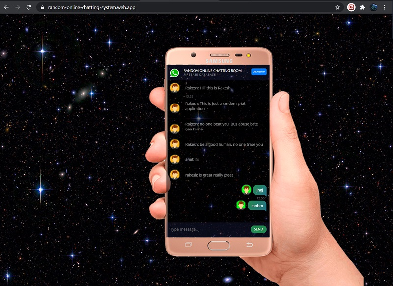
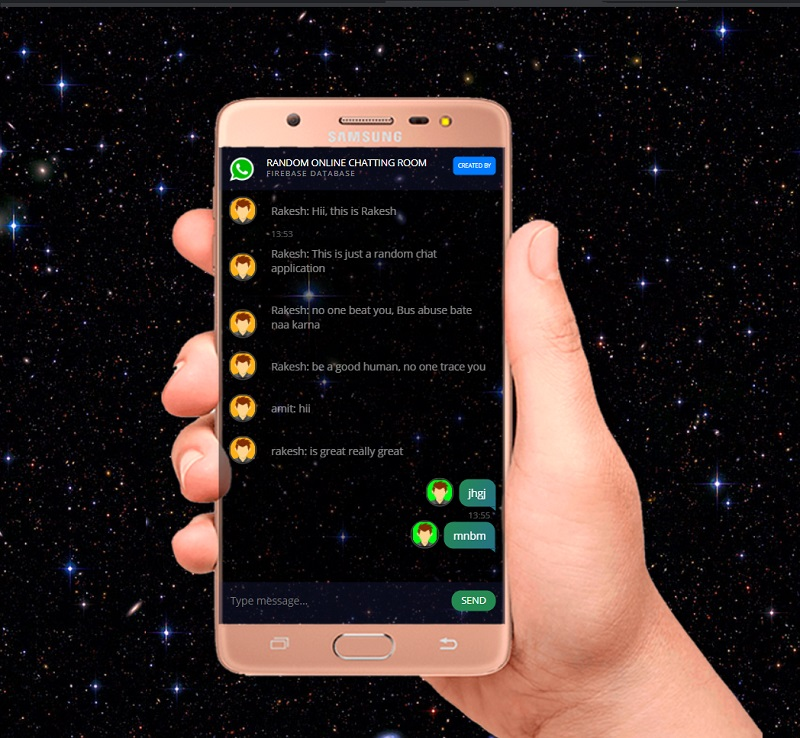

# Random Online Chatting with Firebase Real time database Basics

[Link to Live Demo](https://random-online-chatting-system.web.app/)

Star⭐ the repo if you like what you see😉.

## ✨ Instructions
* Create firebase project
* Enable Real-time database and Hosting
* Follow the command in windows cmd input-> firebase login
* after successfull login into the firebase cli. cmd input -> firebase init
* After selecting the exact project go to the folder and place only public folder into you project directory
* After that deploy into firebase. cmd input -> firebase deploy
* Now you'll ready to serve 🤓🤓

## 📸 ScreenShots

